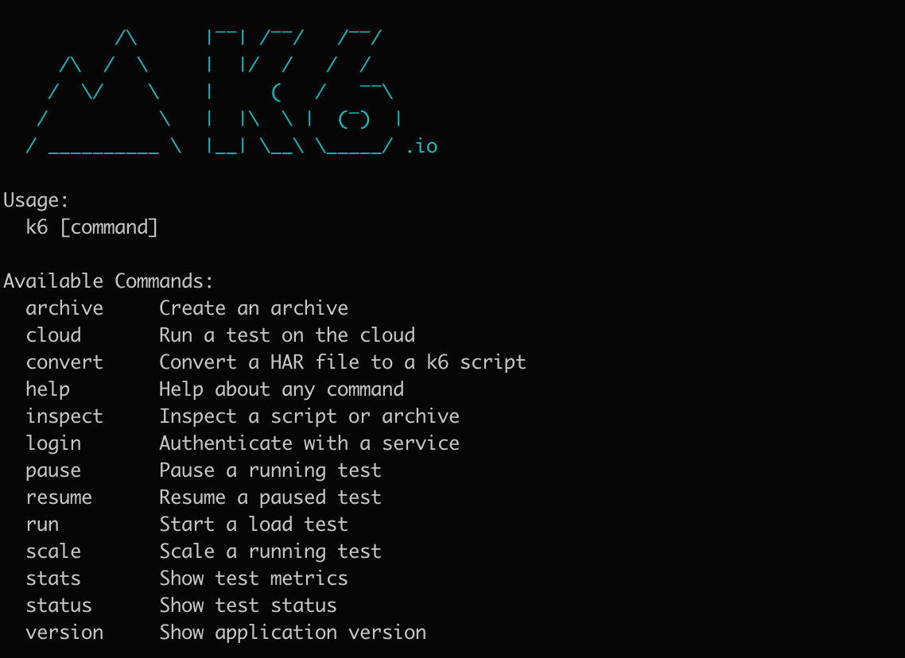
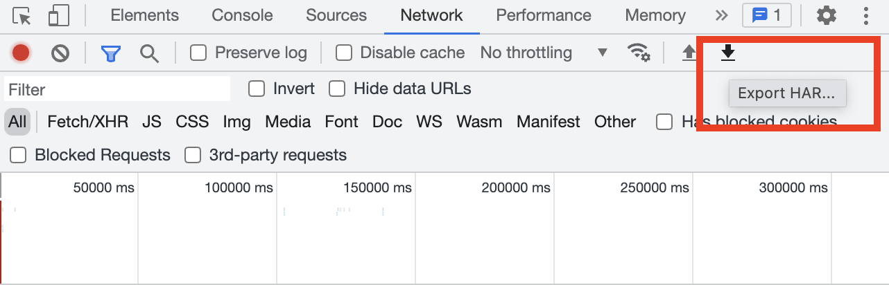
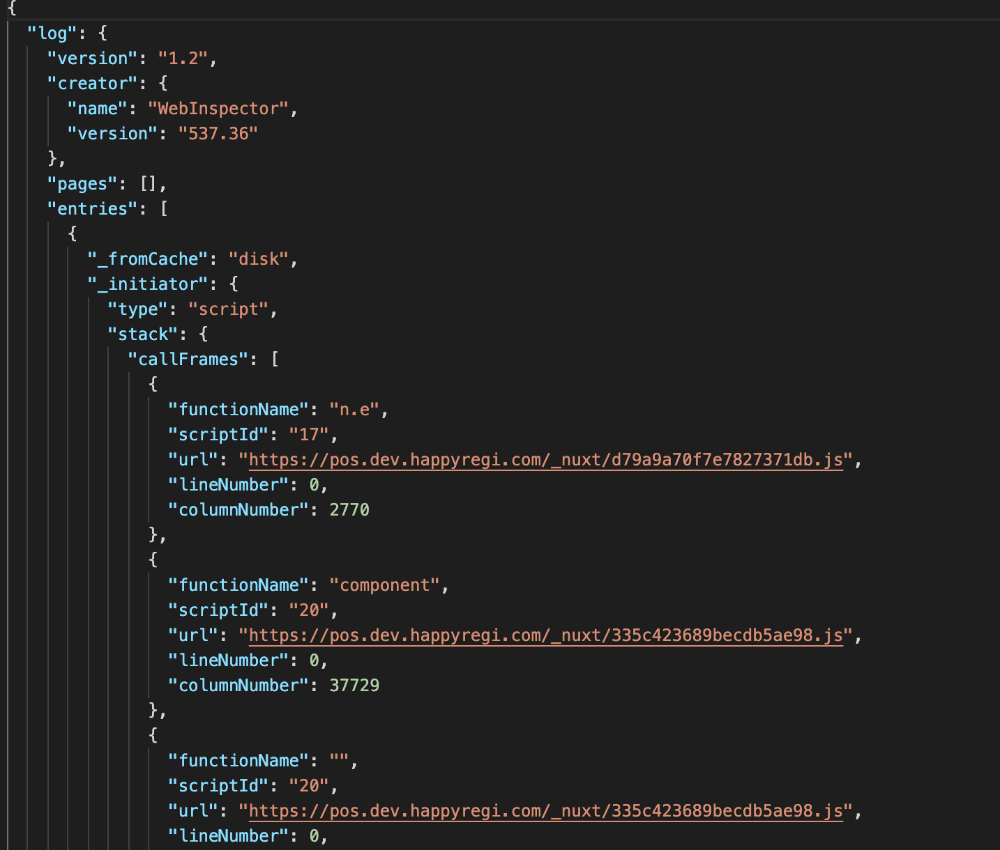
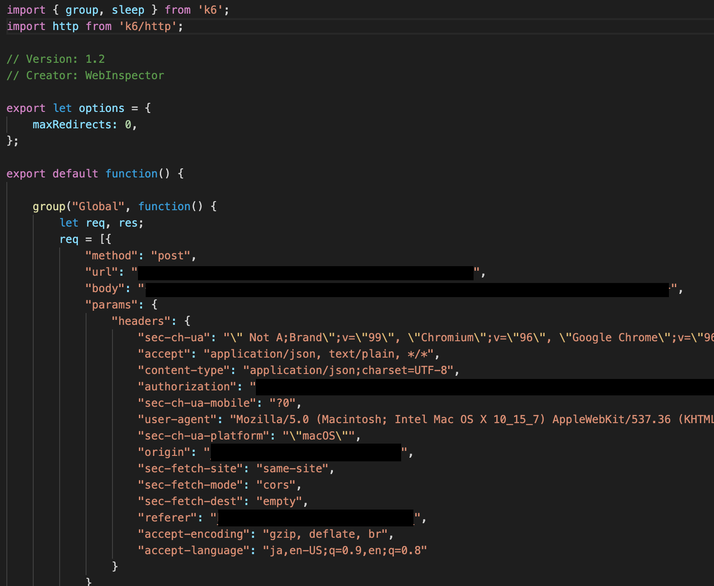
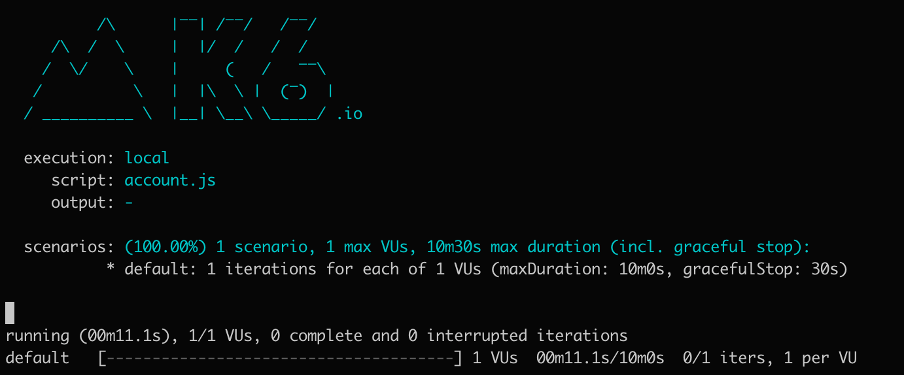
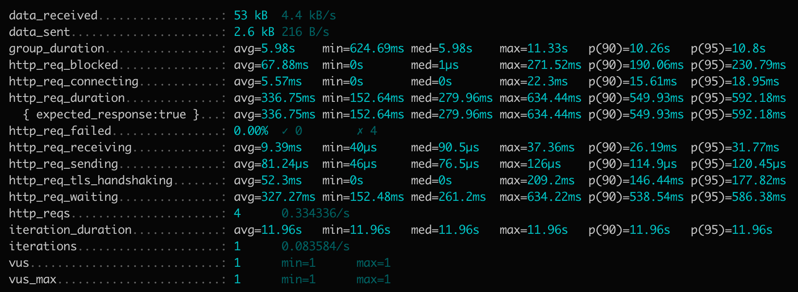
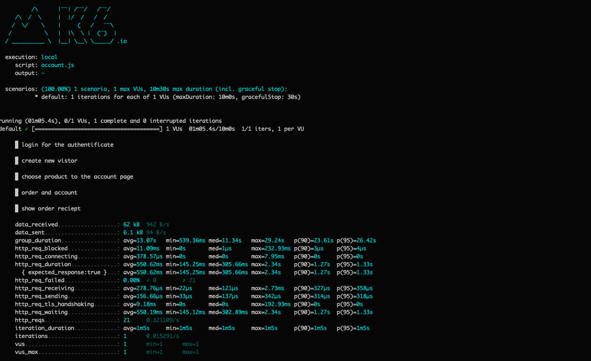
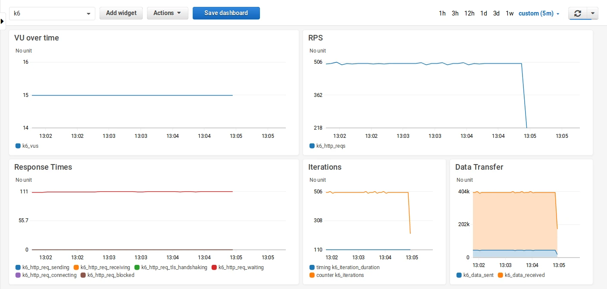
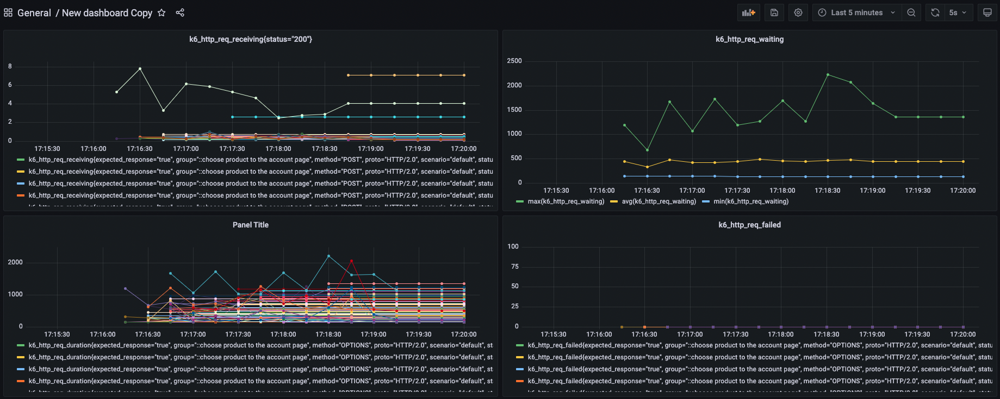

title: k6ではじめる<br>負荷試験入門
title_fotter: k6ではじめる負荷試験入門
class: animation-fade
layout: true

<!-- This slide will serve as the base layout for all your slides -->
.bottom-bar[
  {{title_fotter}}
  Mt.SQUARE Machida
]

---

class: impact

# {{title}}
## JavaScriptで書けるよ

---

.center[
# 本日のやること

### k6ってなに？
### 負荷試験のイメージ
### どうやって使うの？
### 実行までの道のり
### アウトプット
### おわりに
]

---

# k6ってなに？

--

### Go言語で開発されたモダンな負荷試験ツール

負荷試験サービス会社「Load Impact」が提供している

--

## なぜk6を使うのか

おすすめポイント:
--

- 負荷試験サービスとして多くの企業に採用されている会社のツールである
--

- インストールまでが容易で比較的楽に実行環境を用意できる
--

- JavaScriptで書けるので開発者も取っ付き易い
--

- 作成したシナリオをコードで管理できる
--

- CLIで実行できる
--

- 試験結果を様々な外部システムと組み合わせることができる

---

# 負荷試験のイメージ

--

.big[
負荷をかけないといけないのはわかってるけど・・
]
--

.big[
JMeter？聞いたことはあるよ
]
--

.big[
XMLなんて扱えない・・
]
--

.big[
(触りたくないという願望)
]
--

<br>
とかとか、いろいろあるけど、、
--

<br><br>

.big[
結局のとこ、何から始めたらいいのかわからない
]

---

# どうやって使うの？

--

k6は基本的に負荷試験のシナリオをJavaScriptで記載し、CLIで実行することで負荷試験を行えます。

--

```JavaScript
import http from 'k6/http'

export default function () {
  http.get('http://localhost:8080/')
}
```

こんな感じでJavaScriptを書いていくだけです。

--

## 入門に備えて

用意するもの:

--

- k6
--

- HARファイル
--

  - Http ARchiveファイル: WebブラウザとのやりとりをJSON形式で記録したもの
--


この2つがあればすぐに実行できます！

---

# 実行までの道のり

--

- ### k6のインストール

--

- ### HARファイルの取得

--

- ### HARファイルに一手間加える

--

- ### シナリオの実行

---

## k6のインストール

--

```bash
$ brew install k6
```

--

.col-6[
  


]

--

.col-6[

← 完了するとこのようになります。

<br>

実行コマンドもケース別に多数あります。

※ 詳細は公式へ ... 🙇‍♂️

<br>

今回は `run` コマンドを使用する前提でお話しします！

]

---

# 実行までの道のり

- ### ~~k6のインストール~~
- ### HARファイルの取得
- ### HARファイルに一手間加える
- ### シナリオの実行

---

## HAR(Http ARchive)ファイルの取得

--

HARファイルはChromeの機能を活用して取得します。

--

.col-6[

1. 開発者ツールを開く
2. `Network` タブへ移動
3. 画面側でシナリオにしたい操作を行う
4. `Export HAR...` でファイルをダウンロード

<br>



]

--

.col-6[

ファイルの中身はこんな感じです。
よくわかりません。



]

---

# 実行までの道のり

- ### ~~k6のインストール~~
- ### ~~HARファイルの取得~~
- ### HARファイルに一手間加える
- ### シナリオの実行

---

## HARファイルに一手間加える

--

k6はJavaScriptで実行させるため、ダウンロードしたHARファイルをjsファイルに加工します。

--

.col-6[

### どうやって加工するのか

簡単です。

k6が便利なコマンドを用意してくれてます、神。

```bash
$ k6 convert --output {加工後.js} {ダウンロードしたharファイル}
```

]

--

.col-6[

### jsファイルの完成です



※ API通信での実行をしたかったのでリクエストを絞ってます。

]

---

# 実行までの道のり

- ### ~~k6のインストール~~
- ### ~~HARファイルの取得~~
- ### ~~HARファイルに一手間加える~~
- ### シナリオの実行

---

## シナリオの実行

--

実行はユニットテストなどでやるようにコマンドを打って眺めるだけです。

--

```bash
$ k6 run {jsファイル}
```

--

.col-6[

#### <span style="color: gray;">実行中</span>



]

--

.col-6[

#### 実行完了



実行の最後に結果を要約したレポートを表示します。

]

---

## レポートで重要なもの

--

出力結果の詳細に関しては特に重要だと思うものだけ説明しますが、その他は割愛します。

--

.col-8[



]

--

.col-4[

- **vus**
  - 同時実行した仮想ユーザの数

- **iteration_duration**
  - メイン関数の実行を完了するのに要した時間

- **http_req_duration**
  - リクエストの合計時間

]

---

# アウトプット

--

オプション`--out`を用いてレポート結果の出力先や形式を変更することで、様々なサービスとの連携が可能です。

公式: https://k6.io/docs/getting-started/results-output/#external-outputs

--

<br>

## 外連携可能サービス一覧

--

.col-4[

- Amazon CloudWatch

- Apache Kafka

- Cloud

- CSV

]

--

.col-4[

- Datadog

- Grafana Cloud / Prometheus

- InfluxDB

- JSON

]

--

.col-4[

- Netdata

- New Relic

- Prometheus

- StatsD

]

--

#### などのサービスとの連携をすることで、可視化してより見やすい情報を得ることもできます。


---

## 可視化の例

--

ダッシュボードの作成から表示したいメトリクスなどをカスタマイズすることで下記のようなグラフで可視化出来ます。

--

**Amazon CloudWatch**



.small[<span style="color:gray;">※ 公式引用</span>]

---

**Grafana Cloud**

URL: https://grafana.com/

--



---

# おわりに

--

.big[
k6の触りの部分を簡単に紹介しました。
<br><br>
JMeterでシナリオを作る辛さを実際に体験したわけではないんですが、k6は導入から実行までさくさくいけるので、あれこれ試行錯誤せずに楽に行うことができました。
<br><br>
JavaScriptで書けるので学習コストがそこまでかからないのも利点ですよね。
<br><br>
もっと複雑なシナリオを書く必要が出てくると、少し難しいところも出てくるかもしれませんが、現時点では扱いやすい負荷試験ツールだなという感想です！
<br><br>
是非この機会に触ってみてください！
]

.small[
<span style="color:gray;">やってみたいけどわからなかったって人は連絡ください、できる範囲で共有します。</span>
]

---

class: impact

## 以上、ご静聴ありがとうございました。
(今年も1年間、お疲れさまでした。🍻)
